# &#x1F6A9; AWS Lambda : Deploying Python Functions with Additional Libraries in AWS Lambda.

&nbsp;

Reference :  
<!-- -   Docs | dev.aryya.id Swagger
    <pre>http://dev.aryya.id/#/default/get_dns_record_query</pre> 

-   YT | Mendeploy Python Function Dengan Library Tambahan di AWS Lambda | AWS Tutorial Bahasa Indonesia
    <pre>https://www.youtube.com/watch?v=PjKM2RyQ-v8</pre> 
    6.39s

-->

-   Docs | Working with .zip file archives for Python Lambda functions
    <pre>https://docs.aws.amazon.com/lambda/latest/dg/python-package.html</pre>
    
-   Docs | aws lambda working with python
    <pre>https://github.com/csemanish12/aws-lambda?tab=readme-ov-file#readme</pre>
&nbsp;

&nbsp;

Endpoint source (for `03-code-project-dns-record-query`):
<pre>
    ❯ curl -X 'GET' \
    'https://us-central1-zeta-structure-296509.cloudfunctions.net/dns-record-query?record_name=detik.com&record_type=A' \
    -H 'accept: application/json'

    # response : 
        {"record_name":"detik.com","record_type":"A","result":["203.190.242.211","103.49.221.211"]}
</pre>

---

&nbsp;

&nbsp;

&nbsp;

### &#x1F530; Set up aws lambda functions in the aws management console :

    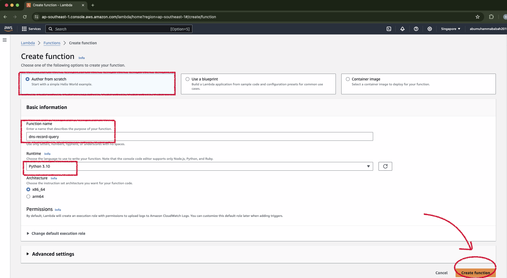

 

&nbsp;

    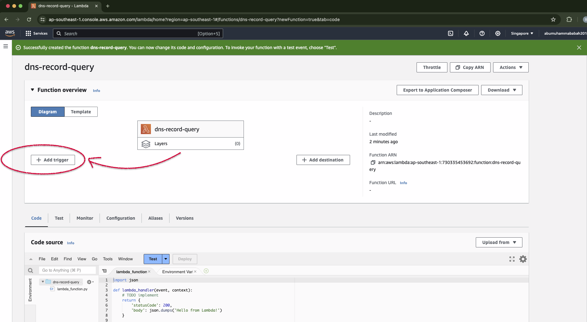

 

&nbsp;

    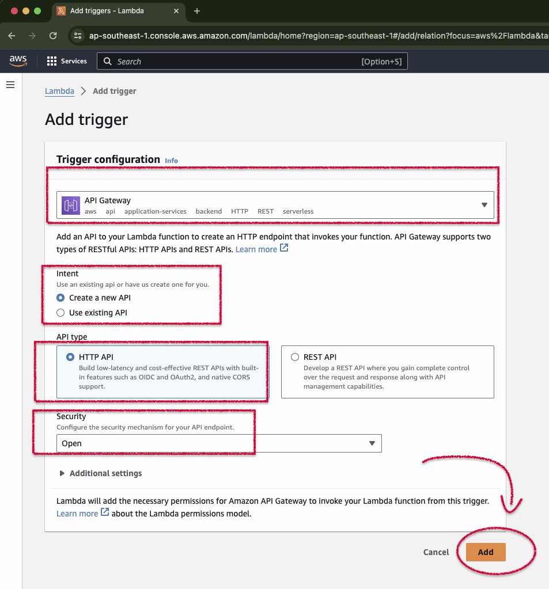

 

&nbsp;

    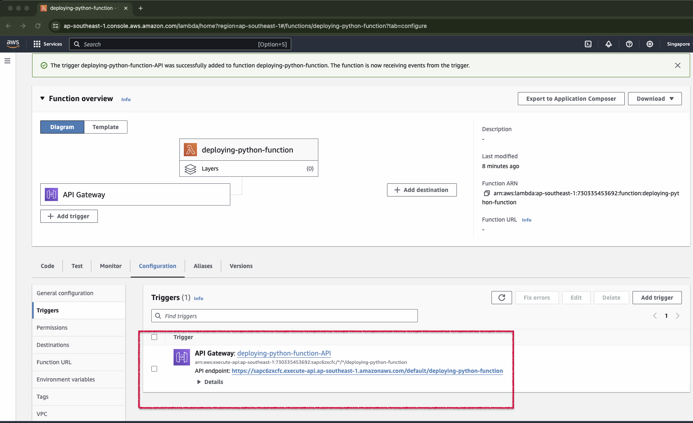

 

&nbsp;

---

&nbsp;

Environment : 
<pre>
    ❯ python --version

        Python 3.10.3
</pre>

&nbsp;

&nbsp;

### Begin :
### &#x1F530; Deployment package with no dependency

<pre>
    ❯ mkdir 01-code-project-basic

    ❯ cd 01-code-project-basic

    ❯ touch lambda_function.py
</pre>

&#x1F680; Code :
<pre>
    ❯ vim lambda_function.py

        import json

        def lambda_handler(event, context):
            # TODO implement
            return {
                'statusCode': 200,
                'body': json.dumps('Hello from zipped file in Lambda!')
            }
</pre>

&nbsp;

Add the lambda_function.py file to the root of the .zip file.
<pre>
    ❯ zip deployment-package.zip lambda_function.py

        adding: lambda_function.py (deflated 20%)

    ❯ ls -lah
        -rw-r--r--   1 &lt;user&gt;  staff   330B Apr 15 17:14 deployment-package.zip
        -rw-r--r--   1 &lt;user&gt;  staff   180B Apr 15 14:01 lambda_function.py        
</pre>

&nbsp;

Upload Code source from .zip file.

    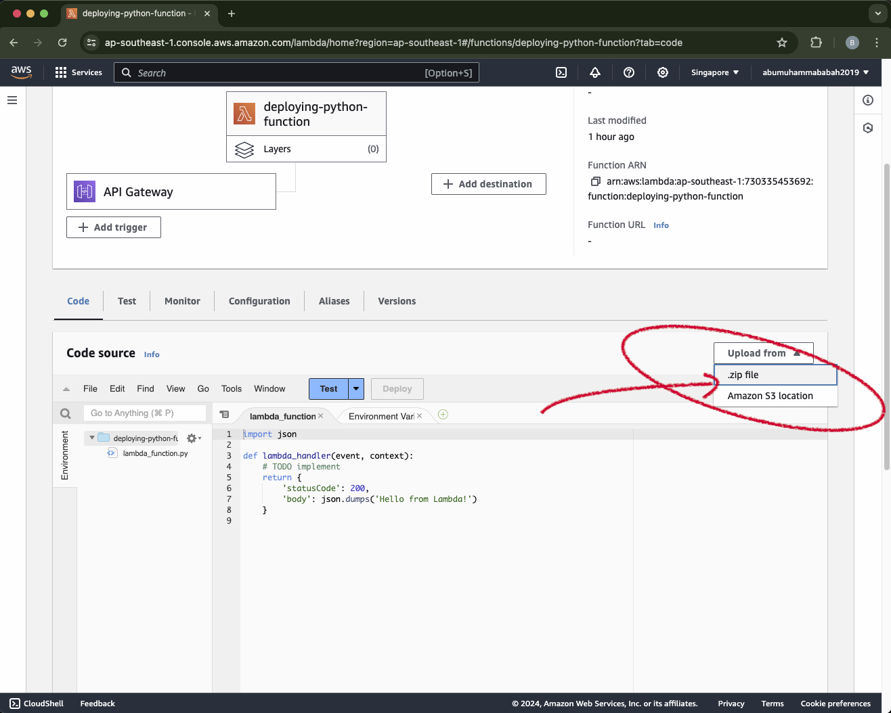

 

&nbsp;

    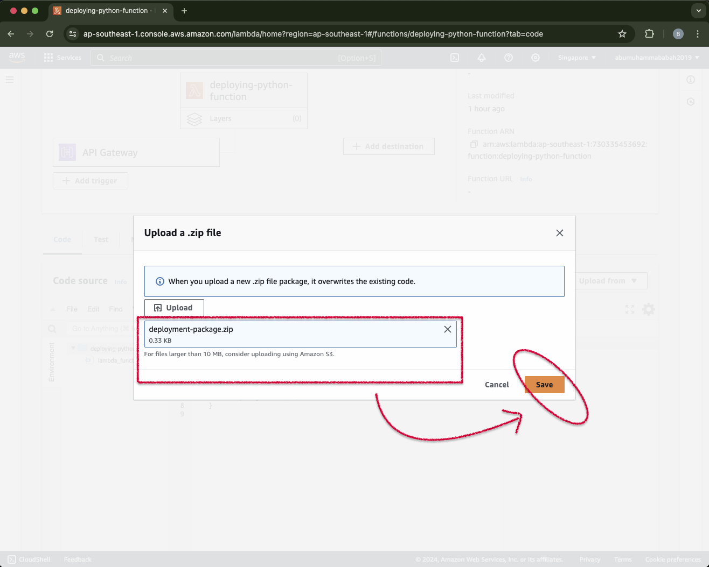

 

&nbsp;

    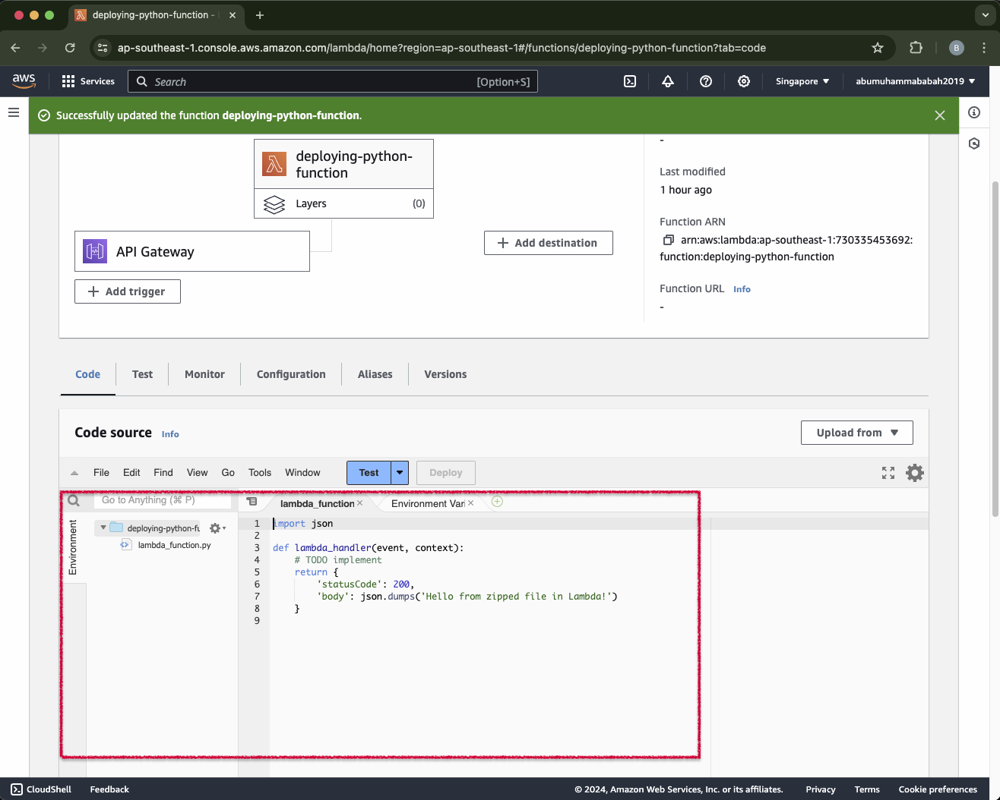

 

&nbsp;

    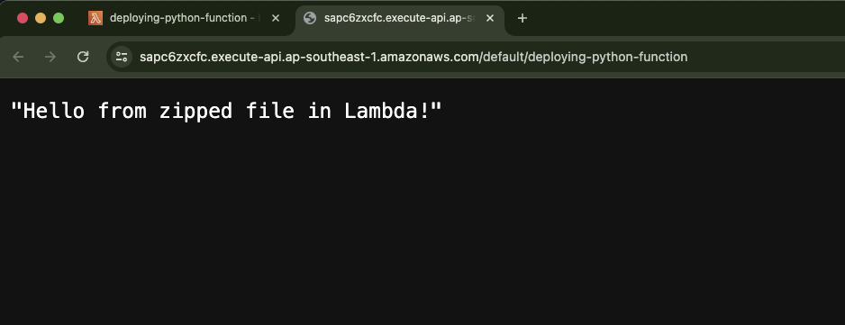

 

&nbsp;

&nbsp;

&nbsp;

    

 

&nbsp;

&nbsp;

&nbsp;

---

&nbsp;

### &#x1F530; Deployment package with dependency

<pre>
    ❯ mkdir 02-code-project-with-dependency

    ❯ cd 02-code-project-with-dependency

    ❯ touch lambda_function.py
</pre>

&#x1F680; Code :
<pre>
    ❯ vim lambda_function.py

        import requests
        import json

        def lambda_handler(event, context):   
            response = requests.get("https://www.example.com/")
            confirmation_message = "GET request to 'https://www.example.com/' was successful."
            data = {
                'confirmation_message': confirmation_message,
                'page_content': response.text
            }
            print(data)
            return {
                'statusCode': 200,
                'body': json.dumps(data)
            }
</pre>

&nbsp;

Install the requests library to a new package directory.
<pre>
    ❯ pip install --target ./package requests

        Collecting requests
        Using cached requests-2.31.0-py3-none-any.whl (62 kB)
        Collecting charset-normalizer<4,>=2 (from requests)
        Using cached charset_normalizer-3.3.2-cp310-cp310-macosx_11_0_arm64.whl (120 kB)
        Collecting idna<4,>=2.5 (from requests)
        Using cached idna-3.7-py3-none-any.whl (66 kB)
        Collecting urllib3<3,>=1.21.1 (from requests)
        Using cached urllib3-2.2.1-py3-none-any.whl (121 kB)
        Collecting certifi>=2017.4.17 (from requests)
        Using cached certifi-2024.2.2-py3-none-any.whl (163 kB)
        Installing collected packages: urllib3, idna, charset-normalizer, certifi, requests
        Successfully installed certifi-2024.2.2 charset-normalizer-3.3.2 idna-3.7 requests-2.31.0 urllib3-2.2.1

        [notice] A new release of pip is available: 23.1.1 -> 24.0
        [notice] To update, run: pip install --upgrade pip

    ❯ ls -lah

        -rw-r--r--   1 &lt;user&gt;  staff   417B Apr 15 16:20 lambda_function.py
        drwxr-xr-x  13 &lt;user&gt;  staff   416B Apr 15 22:39 package
</pre>

&nbsp;

Create a deployment package with the installed library at the root.
<pre>
    ❯ cd package

    ❯ zip -r ../deployment-package.zip .

        adding: bin/ (stored 0%)
        adding: bin/normalizer (deflated 26%)
        adding: idna/ (stored 0%)
        adding: idna/intranges.py (deflated 57%)
        adding: idna/package_data.py (stored 0%)
        adding: idna/compat.py (deflated 40%)
        adding: idna/idnadata.py (deflated 81%)
        adding: idna/__init__.py (deflated 67%)
        adding: idna/core.py (deflated 76%)
        adding: idna/__pycache__/ (stored 0%)
        adding: idna/__pycache__/codec.cpython-310.pyc (deflated 51%)
        adding: idna/__pycache__/core.cpython-310.pyc (deflated 50%)
        adding: idna/__pycache__/compat.cpython-310.pyc (deflated 34%)
        adding: idna/__pycache__/idnadata.cpython-310.pyc (deflated 83%)
        adding: idna/__pycache__/package_data.cpython-310.pyc (deflated 15%)
        adding: idna/__pycache__/uts46data.cpython-310.pyc (deflated 74%)
        adding: idna/__pycache__/intranges.cpython-310.pyc (deflated 39%)
        adding: idna/__pycache__/__init__.cpython-310.pyc (deflated 39%)
        adding: idna/py.typed (stored 0%)
        adding: idna/codec.py (deflated 76%)
        adding: idna/uts46data.py (deflated 80%)
        adding: charset_normalizer/ (stored 0%)
        adding: charset_normalizer/md.py (deflated 81%)
        adding: charset_normalizer/version.py (deflated 19%)
        adding: charset_normalizer/md.cpython-310-darwin.so (deflated 97%)
        adding: charset_normalizer/legacy.py (deflated 55%)
        adding: charset_normalizer/models.py (deflated 72%)
        adding: charset_normalizer/__init__.py (deflated 49%)
        adding: charset_normalizer/__pycache__/ (stored 0%)
        adding: charset_normalizer/__pycache__/constant.cpython-310.pyc (deflated 54%)
        adding: charset_normalizer/__pycache__/api.cpython-310.pyc (deflated 50%)
        adding: charset_normalizer/__pycache__/legacy.cpython-310.pyc (deflated 36%)
        adding: charset_normalizer/__pycache__/utils.cpython-310.pyc (deflated 49%)
        adding: charset_normalizer/__pycache__/models.cpython-310.pyc (deflated 56%)
        adding: charset_normalizer/__pycache__/md.cpython-310.pyc (deflated 60%)
        adding: charset_normalizer/__pycache__/cd.cpython-310.pyc (deflated 49%)
        adding: charset_normalizer/__pycache__/__main__.cpython-310.pyc (deflated 17%)
        adding: charset_normalizer/__pycache__/__init__.cpython-310.pyc (deflated 38%)
        adding: charset_normalizer/__pycache__/version.cpython-310.pyc (deflated 14%)
        adding: charset_normalizer/cli/ (stored 0%)
        adding: charset_normalizer/cli/__init__.py (deflated 24%)
        adding: charset_normalizer/cli/__pycache__/ (stored 0%)
        adding: charset_normalizer/cli/__pycache__/__main__.cpython-310.pyc (deflated 42%)
        adding: charset_normalizer/cli/__pycache__/__init__.cpython-310.pyc (deflated 17%)
        adding: charset_normalizer/cli/__main__.py (deflated 72%)
        adding: charset_normalizer/md__mypyc.cpython-310-darwin.so (deflated 70%)
        adding: charset_normalizer/api.py (deflated 77%)
        adding: charset_normalizer/utils.py (deflated 75%)
        adding: charset_normalizer/py.typed (stored 0%)
        adding: charset_normalizer/constant.py (deflated 76%)
        adding: charset_normalizer/__main__.py (deflated 12%)
        adding: charset_normalizer/cd.py (deflated 74%)
        adding: requests/ (stored 0%)
        adding: requests/cookies.py (deflated 73%)
        adding: requests/auth.py (deflated 71%)
        adding: requests/sessions.py (deflated 72%)
        adding: requests/hooks.py (deflated 51%)
        adding: requests/compat.py (deflated 57%)
        adding: requests/models.py (deflated 72%)
        adding: requests/certs.py (deflated 36%)
        adding: requests/__init__.py (deflated 64%)
        adding: requests/status_codes.py (deflated 61%)
        adding: requests/packages.py (deflated 53%)
        adding: requests/__version__.py (deflated 40%)
        adding: requests/__pycache__/ (stored 0%)
        adding: requests/__pycache__/__version__.cpython-310.pyc (deflated 25%)
        adding: requests/__pycache__/api.cpython-310.pyc (deflated 69%)
        adding: requests/__pycache__/adapters.cpython-310.pyc (deflated 59%)
        adding: requests/__pycache__/_internal_utils.cpython-310.pyc (deflated 39%)
        adding: requests/__pycache__/compat.cpython-310.pyc (deflated 35%)
        adding: requests/__pycache__/cookies.cpython-310.pyc (deflated 59%)
        adding: requests/__pycache__/sessions.cpython-310.pyc (deflated 56%)
        adding: requests/__pycache__/hooks.cpython-310.pyc (deflated 35%)
        adding: requests/__pycache__/utils.cpython-310.pyc (deflated 51%)
        adding: requests/__pycache__/status_codes.cpython-310.pyc (deflated 43%)
        adding: requests/__pycache__/exceptions.cpython-310.pyc (deflated 59%)
        adding: requests/__pycache__/models.cpython-310.pyc (deflated 53%)
        adding: requests/__pycache__/help.cpython-310.pyc (deflated 43%)
        adding: requests/__pycache__/packages.cpython-310.pyc (deflated 26%)
        adding: requests/__pycache__/auth.cpython-310.pyc (deflated 51%)
        adding: requests/__pycache__/certs.cpython-310.pyc (deflated 29%)
        adding: requests/__pycache__/structures.cpython-310.pyc (deflated 54%)
        adding: requests/__pycache__/__init__.cpython-310.pyc (deflated 41%)
        adding: requests/api.py (deflated 75%)
        adding: requests/_internal_utils.py (deflated 57%)
        adding: requests/utils.py (deflated 68%)
        adding: requests/exceptions.py (deflated 67%)
        adding: requests/structures.py (deflated 62%)
        adding: requests/help.py (deflated 70%)
        adding: requests/adapters.py (deflated 75%)
        adding: requests-2.31.0.dist-info/ (stored 0%)
        adding: requests-2.31.0.dist-info/RECORD (deflated 55%)
        adding: requests-2.31.0.dist-info/LICENSE (deflated 65%)
        adding: requests-2.31.0.dist-info/WHEEL (stored 0%)
        adding: requests-2.31.0.dist-info/top_level.txt (stored 0%)
        adding: requests-2.31.0.dist-info/REQUESTED (stored 0%)
        adding: requests-2.31.0.dist-info/INSTALLER (stored 0%)
        adding: requests-2.31.0.dist-info/METADATA (deflated 57%)
        adding: certifi/ (stored 0%)
        adding: certifi/__init__.py (deflated 14%)
        adding: certifi/core.py (deflated 71%)
        adding: certifi/__pycache__/ (stored 0%)
        adding: certifi/__pycache__/core.cpython-310.pyc (deflated 44%)
        adding: certifi/__pycache__/__main__.cpython-310.pyc (deflated 25%)
        adding: certifi/__pycache__/__init__.cpython-310.pyc (deflated 19%)
        adding: certifi/py.typed (stored 0%)
        adding: certifi/cacert.pem (deflated 46%)
        adding: certifi/__main__.py (deflated 39%)
        adding: charset_normalizer-3.3.2.dist-info/ (stored 0%)
        adding: charset_normalizer-3.3.2.dist-info/RECORD (deflated 57%)
        adding: charset_normalizer-3.3.2.dist-info/LICENSE (deflated 41%)
        adding: charset_normalizer-3.3.2.dist-info/WHEEL (deflated 5%)
        adding: charset_normalizer-3.3.2.dist-info/entry_points.txt (deflated 12%)
        adding: charset_normalizer-3.3.2.dist-info/top_level.txt (stored 0%)
        adding: charset_normalizer-3.3.2.dist-info/INSTALLER (stored 0%)
        adding: charset_normalizer-3.3.2.dist-info/METADATA (deflated 67%)
        adding: urllib3-2.2.1.dist-info/ (stored 0%)
        adding: urllib3-2.2.1.dist-info/RECORD (deflated 60%)
        adding: urllib3-2.2.1.dist-info/licenses/ (stored 0%)
        adding: urllib3-2.2.1.dist-info/licenses/LICENSE.txt (deflated 41%)
        adding: urllib3-2.2.1.dist-info/WHEEL (deflated 1%)
        adding: urllib3-2.2.1.dist-info/INSTALLER (stored 0%)
        adding: urllib3-2.2.1.dist-info/METADATA (deflated 61%)
        adding: certifi-2024.2.2.dist-info/ (stored 0%)
        adding: certifi-2024.2.2.dist-info/RECORD (deflated 43%)
        adding: certifi-2024.2.2.dist-info/LICENSE (deflated 42%)
        adding: certifi-2024.2.2.dist-info/WHEEL (stored 0%)
        adding: certifi-2024.2.2.dist-info/top_level.txt (stored 0%)
        adding: certifi-2024.2.2.dist-info/INSTALLER (stored 0%)
        adding: certifi-2024.2.2.dist-info/METADATA (deflated 58%)
        adding: idna-3.7.dist-info/ (stored 0%)
        adding: idna-3.7.dist-info/LICENSE.md (deflated 47%)
        adding: idna-3.7.dist-info/RECORD (deflated 48%)
        adding: idna-3.7.dist-info/WHEEL (stored 0%)
        adding: idna-3.7.dist-info/INSTALLER (stored 0%)
        adding: idna-3.7.dist-info/METADATA (deflated 61%)
        adding: urllib3/ (stored 0%)
        adding: urllib3/filepost.py (deflated 61%)
        adding: urllib3/fields.py (deflated 73%)
        adding: urllib3/util/ (stored 0%)
        adding: urllib3/util/ssltransport.py (deflated 71%)
        adding: urllib3/util/util.py (deflated 66%)
        adding: urllib3/util/proxy.py (deflated 58%)
        adding: urllib3/util/wait.py (deflated 63%)
        adding: urllib3/util/request.py (deflated 65%)
        adding: urllib3/util/timeout.py (deflated 70%)
        adding: urllib3/util/__init__.py (deflated 59%)
        adding: urllib3/util/response.py (deflated 61%)
        adding: urllib3/util/ssl_.py (deflated 69%)
        adding: urllib3/util/__pycache__/ (stored 0%)
        adding: urllib3/util/__pycache__/wait.cpython-310.pyc (deflated 47%)
        adding: urllib3/util/__pycache__/ssltransport.cpython-310.pyc (deflated 54%)
        adding: urllib3/util/__pycache__/response.cpython-310.pyc (deflated 43%)
        adding: urllib3/util/__pycache__/ssl_match_hostname.cpython-310.pyc (deflated 40%)
        adding: urllib3/util/__pycache__/timeout.cpython-310.pyc (deflated 59%)
        adding: urllib3/util/__pycache__/util.cpython-310.pyc (deflated 39%)
        adding: urllib3/util/__pycache__/proxy.cpython-310.pyc (deflated 38%)
        adding: urllib3/util/__pycache__/connection.cpython-310.pyc (deflated 41%)
        adding: urllib3/util/__pycache__/retry.cpython-310.pyc (deflated 56%)
        adding: urllib3/util/__pycache__/url.cpython-310.pyc (deflated 49%)
        adding: urllib3/util/__pycache__/ssl_.cpython-310.pyc (deflated 51%)
        adding: urllib3/util/__pycache__/request.cpython-310.pyc (deflated 46%)
        adding: urllib3/util/__pycache__/__init__.cpython-310.pyc (deflated 33%)
        adding: urllib3/util/retry.py (deflated 71%)
        adding: urllib3/util/url.py (deflated 68%)
        adding: urllib3/util/connection.py (deflated 61%)
        adding: urllib3/util/ssl_match_hostname.py (deflated 60%)
        adding: urllib3/_version.py (deflated 3%)
        adding: urllib3/_base_connection.py (deflated 73%)
        adding: urllib3/__init__.py (deflated 61%)
        adding: urllib3/http2.py (deflated 70%)
        adding: urllib3/poolmanager.py (deflated 72%)
        adding: urllib3/response.py (deflated 75%)
        adding: urllib3/__pycache__/ (stored 0%)
        adding: urllib3/__pycache__/poolmanager.cpython-310.pyc (deflated 55%)
        adding: urllib3/__pycache__/filepost.cpython-310.pyc (deflated 40%)
        adding: urllib3/__pycache__/connectionpool.cpython-310.pyc (deflated 59%)
        adding: urllib3/__pycache__/fields.cpython-310.pyc (deflated 57%)
        adding: urllib3/__pycache__/response.cpython-310.pyc (deflated 57%)
        adding: urllib3/__pycache__/_request_methods.cpython-310.pyc (deflated 61%)
        adding: urllib3/__pycache__/exceptions.cpython-310.pyc (deflated 60%)
        adding: urllib3/__pycache__/_version.cpython-310.pyc (deflated 16%)
        adding: urllib3/__pycache__/connection.cpython-310.pyc (deflated 52%)
        adding: urllib3/__pycache__/_base_connection.cpython-310.pyc (deflated 57%)
        adding: urllib3/__pycache__/__init__.cpython-310.pyc (deflated 48%)
        adding: urllib3/__pycache__/_collections.cpython-310.pyc (deflated 57%)
        adding: urllib3/__pycache__/http2.cpython-310.pyc (deflated 50%)
        adding: urllib3/contrib/ (stored 0%)
        adding: urllib3/contrib/__init__.py (stored 0%)
        adding: urllib3/contrib/__pycache__/ (stored 0%)
        adding: urllib3/contrib/__pycache__/pyopenssl.cpython-310.pyc (deflated 53%)
        adding: urllib3/contrib/__pycache__/socks.cpython-310.pyc (deflated 50%)
        adding: urllib3/contrib/__pycache__/__init__.cpython-310.pyc (deflated 18%)
        adding: urllib3/contrib/emscripten/ (stored 0%)
        adding: urllib3/contrib/emscripten/fetch.py (deflated 71%)
        adding: urllib3/contrib/emscripten/request.py (deflated 49%)
        adding: urllib3/contrib/emscripten/__init__.py (deflated 62%)
        adding: urllib3/contrib/emscripten/response.py (deflated 72%)
        adding: urllib3/contrib/emscripten/__pycache__/ (stored 0%)
        adding: urllib3/contrib/emscripten/__pycache__/fetch.cpython-310.pyc (deflated 50%)
        adding: urllib3/contrib/emscripten/__pycache__/response.cpython-310.pyc (deflated 51%)
        adding: urllib3/contrib/emscripten/__pycache__/connection.cpython-310.pyc (deflated 53%)
        adding: urllib3/contrib/emscripten/__pycache__/request.cpython-310.pyc (deflated 40%)
        adding: urllib3/contrib/emscripten/__pycache__/__init__.cpython-310.pyc (deflated 37%)
        adding: urllib3/contrib/emscripten/connection.py (deflated 74%)
        adding: urllib3/contrib/emscripten/emscripten_fetch_worker.js (deflated 67%)
        adding: urllib3/contrib/socks.py (deflated 69%)
        adding: urllib3/contrib/pyopenssl.py (deflated 72%)
        adding: urllib3/connection.py (deflated 73%)
        adding: urllib3/_collections.py (deflated 71%)
        adding: urllib3/py.typed (deflated 8%)
        adding: urllib3/exceptions.py (deflated 68%)
        adding: urllib3/_request_methods.py (deflated 72%)
        adding: urllib3/connectionpool.py (deflated 74%)

    ❯ cd ..

    ❯ ls -lah

        -rw-r--r--   1 &lt;user&gt;  staff   881K Apr 15 22:42 deployment-package.zip
        -rw-r--r--   1 &lt;user&gt;  staff   417B Apr 15 16:20 lambda_function.py
        drwxr-xr-x  13 &lt;user&gt;  staff   416B Apr 15 22:39 package
</pre>

&nbsp;

Add the lambda_function.py file to the root of the zip file.

<pre>
    ❯ zip deployment-package.zip lambda_function.py

        adding: lambda_function.py (deflated 45%)
</pre>

&nbsp;

Upload Code source from .zip file.

    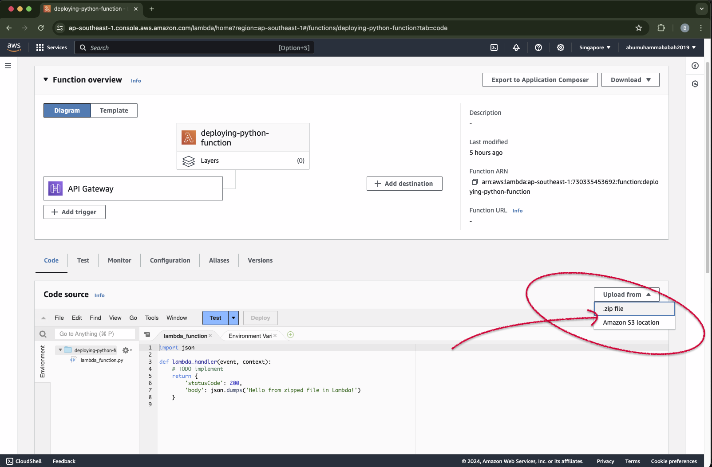

&nbsp;

    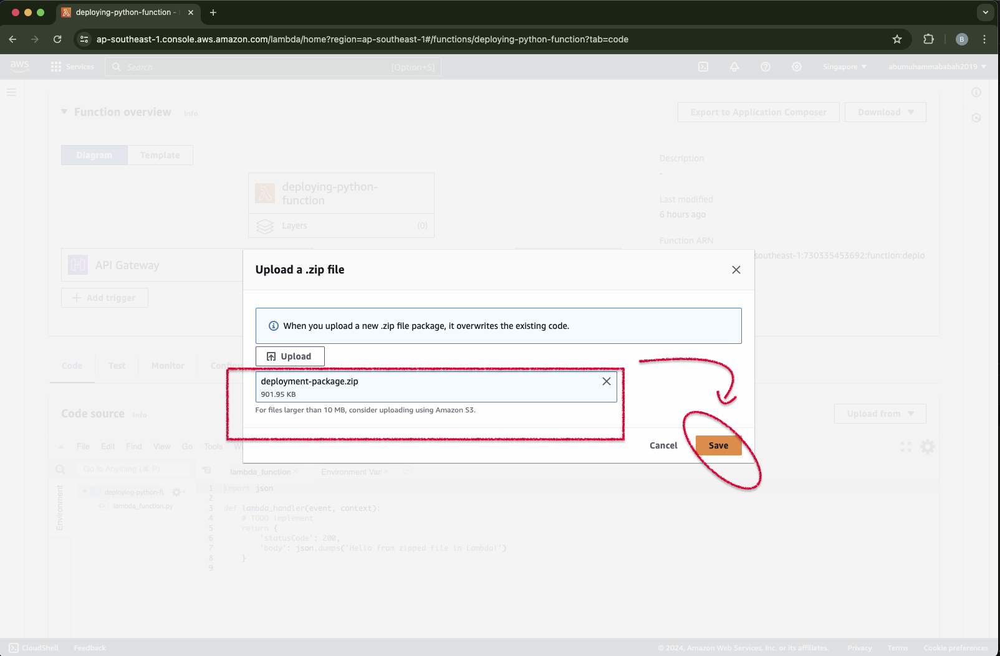

&nbsp;

    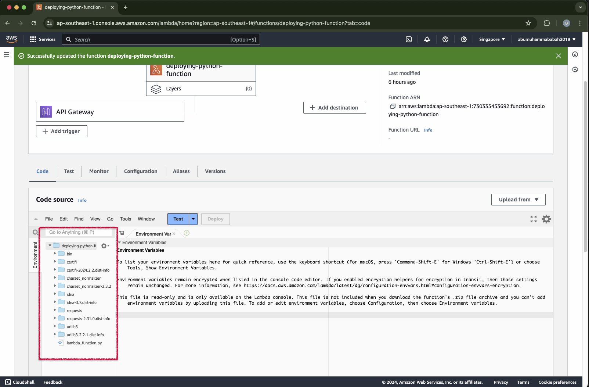

&nbsp;

    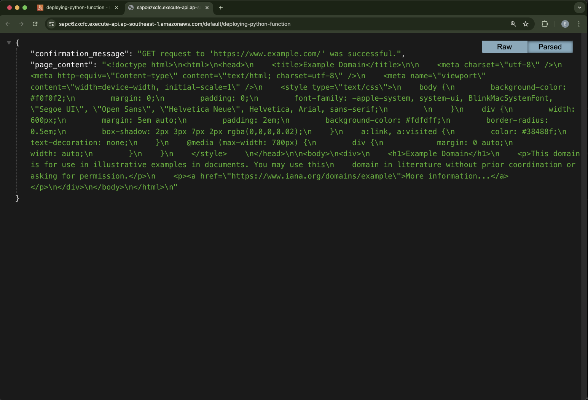

&nbsp;

&nbsp;

&nbsp;

    

 

&nbsp;

&nbsp;

&nbsp;

&nbsp;

&nbsp;

&nbsp;

---

&nbsp;

### &#x1F530; Deployment package while using virtualenv

&nbsp;

---

<pre>
    ❯ cd 02-code-project-with-dependency

    ❯ source .venv/bin/activate

    ❯ pip list

        Package    Version
        ---------- -------
        pip        22.0.4
        setuptools 58.1.0 

    ❯ pip install requests

        Collecting requests
        Using cached requests-2.31.0-py3-none-any.whl (62 kB)
        Collecting urllib3<3,>=1.21.1
        Using cached urllib3-2.2.1-py3-none-any.whl (121 kB)
        Collecting certifi>=2017.4.17
        Using cached certifi-2024.2.2-py3-none-any.whl (163 kB)
        Collecting idna<4,>=2.5
        Using cached idna-3.7-py3-none-any.whl (66 kB)
        Collecting charset-normalizer<4,>=2
        Using cached charset_normalizer-3.3.2-cp310-cp310-macosx_11_0_arm64.whl (120 kB)
        Installing collected packages: urllib3, idna, charset-normalizer, certifi, requests
        Successfully installed certifi-2024.2.2 charset-normalizer-3.3.2 idna-3.7 requests-2.31.0 urllib3-2.2.1

    ❯ pip list

        Package            Version
        ------------------ --------
        certifi            2024.2.2
        charset-normalizer 3.3.2
        idna               3.7
        pip                22.0.4
        requests           2.31.0
        setuptools         58.1.0
        urllib3            2.2.1        
</pre>

&nbsp;

Find the site-packages location of the installed request dependencies.
<pre>
    ❯ pip show requests

        Name: requests
        Version: 2.31.0
        Summary: Python HTTP for Humans.
        Home-page: https://requests.readthedocs.io
        Author: Kenneth Reitz
        Author-email: me@kennethreitz.org
        License: Apache 2.0
        Location: /Users/.../aws-lambda-function-deploying-python-functions-with-additional-libraries/02-code-project-with-dependency/.venv/lib/python3.10/site-packages
        Requires: certifi, charset-normalizer, idna, urllib3
        Required-by:
</pre>

&nbsp;

Deactivate the virtual environment.
<pre>
    ❯ deactivate
</pre>

&nbsp;

<pre>
    ❯ cd .venv/lib/python3.10/site-packages

    ❯ zip -r ../../../../deployment-package-venv.zip .
</pre>

&nbsp;

<pre>
    ❯ cd ../../../../

    ❯ ls -lah | grep -E '.zip|.venv|.py'
 
            drwxr-xr-x   6 &lt;user&gt;  staff   192B Apr 16 05:02 .venv
            -rw-r--r--   1 &lt;user&gt;  staff   6.6M Apr 16 05:09 deployment-package-venv.zip
            -rw-r--r--@  1 &lt;user&gt;  staff   881K Apr 15 23:02 deployment-package.zip
            -rw-r--r--   1 &lt;user&gt;  staff   417B Apr 15 16:20 lambda_function.py
</pre>

&nbsp;
 
Insert the additional `lambda_function.py` file into the resulting `deployment-package-venv.zip` file
<pre>
    ❯ zip -g ./deployment-package-venv.zip lambda_function.py

        adding: lambda_function.py (deflated 45%)              
</pre>

&nbsp;

Upload Code source from .zip file.

    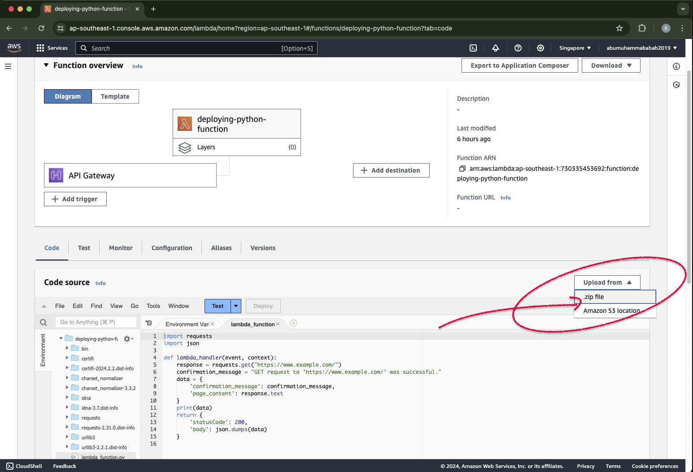

 

&nbsp;

    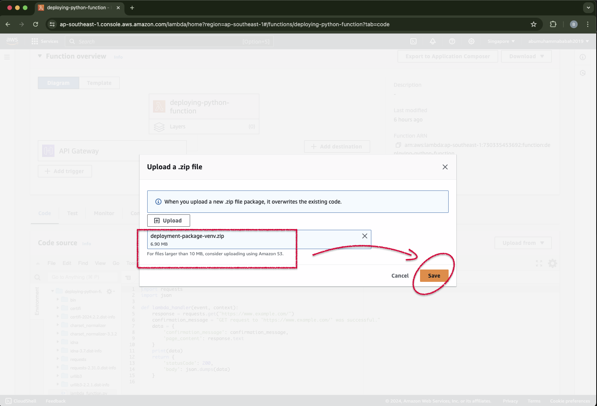

 

&nbsp;

    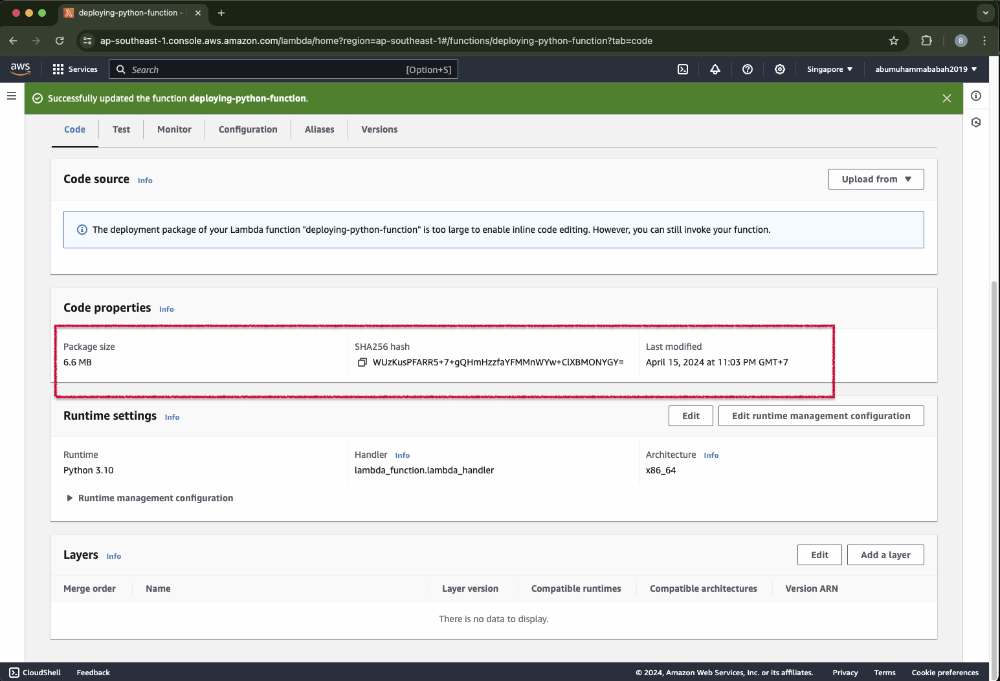

 

&nbsp;

    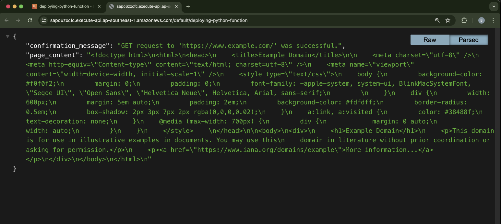

 

&nbsp;

&nbsp;

&nbsp;

    

 

&nbsp;

&nbsp;

&nbsp;

&nbsp;

---

&nbsp;

    

 

&nbsp;

---

&nbsp;

&nbsp;

    

 

&nbsp;

&nbsp;