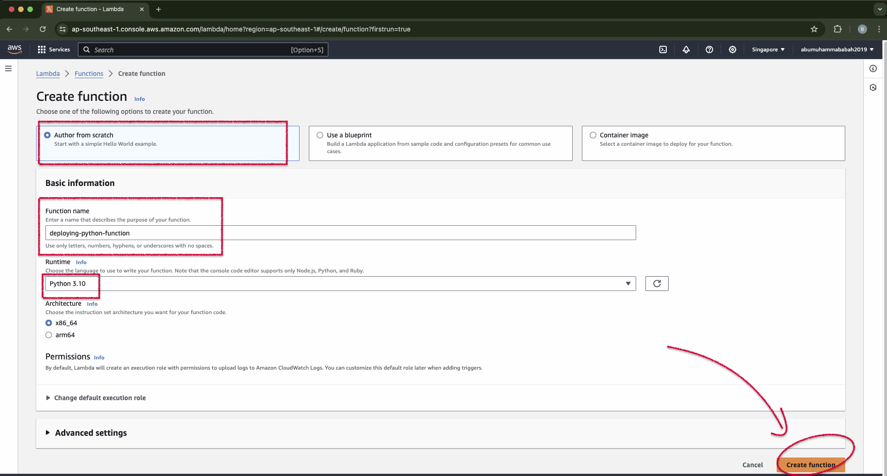
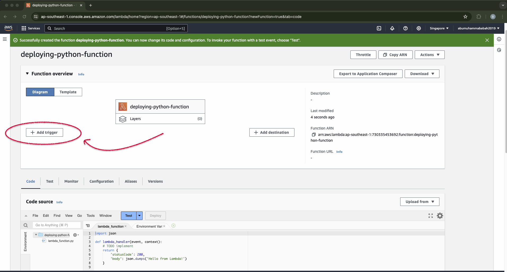

# &#x1F6A9; AWS Lambda : Deploying Python Functions with Additional Libraries in AWS Lambda.

&nbsp;

Reference :  
<!-- -   Docs | dev.aryya.id Swagger
    <pre>http://dev.aryya.id/#/default/get_dns_record_query</pre> 

-   YT | Mendeploy Python Function Dengan Library Tambahan di AWS Lambda | AWS Tutorial Bahasa Indonesia
    <pre>https://www.youtube.com/watch?v=PjKM2RyQ-v8</pre> 
    6.39s

-->

-   Docs | Working with .zip file archives for Python Lambda functions
    <pre>https://docs.aws.amazon.com/lambda/latest/dg/python-package.html</pre>
    
-   Docs | aws lambda working with python
    <pre>https://github.com/csemanish12/aws-lambda?tab=readme-ov-file#readme</pre>
&nbsp;

&nbsp;

Endpoint source (for `03-code-project-dns-record-query`):
<pre>
    ❯ curl -X 'GET' \
    'https://us-central1-zeta-structure-296509.cloudfunctions.net/dns-record-query?record_name=detik.com&record_type=A' \
    -H 'accept: application/json'

    # response : 
        {"record_name":"detik.com","record_type":"A","result":["203.190.242.211","103.49.221.211"]}
</pre>

&nbsp;

&nbsp;

### &#x1F530; Set up aws lambda functions in the aws management console :

    

 

&nbsp;

    

 

&nbsp;

    

 

&nbsp;

    

 

&nbsp;

---

&nbsp;

Environment : 
<pre>
    ❯ python --version

        Python 3.10.3
</pre>

&nbsp;

&nbsp;

### Begin :
**Deployment package with no dependency** 

<pre>
    ❯ mkdir 01-code-project-basic

    ❯ cd 01-code-project-basic

    ❯ touch lambda_function.py
</pre>

&#x1F680; Code :

<pre>
    ❯ vim lambda_function.py

        import json

        def lambda_handler(event, context):
            # TODO implement
            return {
                'statusCode': 200,
                'body': json.dumps('Hello from zipped file in Lambda!')
            }
</pre>

---

&nbsp;

**Deployment package with dependency** 

&nbsp;

&nbsp;

**Deployment package while using virtualenv** 

&nbsp;

---

<pre>
    ❯ vim lambda_function.py

        import json
        import requests

        def lambda_handler(event, context):
            response=requests.get("https://us-central1-zeta-structure-296509.cloudfunctions.net/dns-record-query?record_name={}&record_type={}")
            return {
                'statusCode': 200,
                'body': json.dumps(response)
            }
</pre>

&nbsp;

To create the deployment package (virtual environment).
<pre>
    ❯ pip show requests

        Name: requests
        Version: 2.31.0
        Summary: Python HTTP for Humans.
        Home-page: https://requests.readthedocs.io
        Author: Kenneth Reitz
        Author-email: me@kennethreitz.org
        License: Apache 2.0
        Location: /Users/.../aws-lambda-function-deploying-python-functions-with-additional-libraries/dns-record-query/.venv/lib/python3.10/site-packages
        Requires: certifi, charset-normalizer, idna, urllib3
        Required-by:
</pre>

<pre>
    ❯ deactivate

    ❯ cd .venv/lib/python3.10/site-packages

    ❯ zip -r ../../../../../my_deployment_package.zip .
</pre>

<pre>
    ❯ cd ../../../../../

    ❯ ls -lah | grep -E '.zip|dns-record-query'
 
        drwxr-xr-x   5 &lt;user&gt;  staff   160B Apr 15 13:10 dns-record-query
        -rw-r--r--@  1 &lt;user&gt;  staff   6.6M Apr 15 13:11 my_deployment_package.zip

</pre>

&nbsp;

Insert the additional `lambda_function.py` file into the resulting `my_deployment_package.zip` file
<pre>
    ❯ zip -g ../my_deployment_package.zip lambda_function.py
    
        adding: lambda_function.py (deflated 29%)              
</pre>

&nbsp;

&nbsp;

&nbsp;

&nbsp;

---

&nbsp;

    

 

&nbsp;

---

&nbsp;

&nbsp;

    

 

&nbsp;

&nbsp;